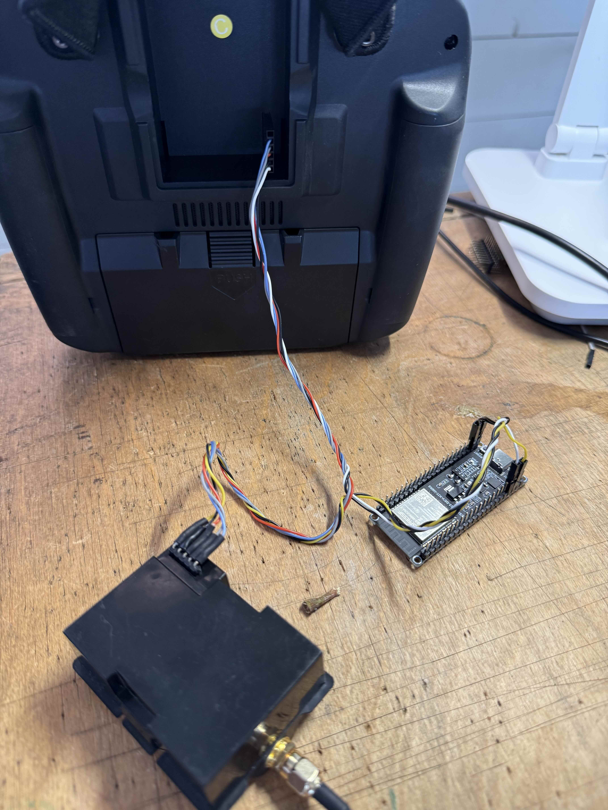

## CRSF Man-In-the-Middle

ESP32 Прошивка для передачі додаткових даних на дрон за допомогою стандартного
радіо каналу який підтримує CRSF протокол (ExpressLRS, TBS)

# Схема підключення передавача #

``` 
Handset (Radiomaster) 
    | 
CRSF-MIM --- WiFi UDP (Skymap) 
    | TX Module
(ExpressLRS)
```

1. Підключення до пульта. CRSF-MIM підключається до пульта по одному UART
   проводу який працює в режимі half-duplex. Протокол детально описаний
[тут](https://github.com/crsf-wg/crsf/wiki) і
[тут](https://github.com/tbs-fpv/tbs-crsf-spec/blob/main/crsf.md).

2. Підключення до CRSF передавального модуля (ExpressLRS, TBS, etc.). Протокол
   комунікації такий самий як і в (1).

3. Підключення до WiFi мережі по UDP для отримання даних зі Skymap. Протокол
   камунікації описаний
[тут](https://gist.github.com/pistolero/2cdde9c985cec415aeb39e89b340cc84)

<p align="center">
    
</p>

``` 
ESP32 GPIO 13 <-> Handset S.Port (нижній пін на пульті) 
ESP32 GPIO 14 <-> TX
Module S.Port ESP32 GND <-> Handset GND (другий з низу пін на пульті) 
ESP32 GND <-> TX Module GND (другий з низу пін на модулі) 
Handset Power <-> TX Module Power (середній пін на пульті та модулі)
```

# Схема підключення приймача #

Приймач ExpressLRS/TBS підключаємо для відлагодження і перевірки роботи системи

``` 
ESP32 GPIO 13 <-> Receiver TX 
ESP32 GPIO 14 <-> Receiver RX 
ESP32 GND <-> Receiver GND 
ESP32 5V <-> Receiver 5V
```

# Задачі #

Для розробки нам необхідні:

* 2 модулі ESP32 S3.
* Пульт Radiomaster
* Передавальний модуль ExpressLRS 
* Приймач EspressLRS

Встановлюємо [esp-idf](https://idf.espressif.com/)

Сперша збираємо по схемі підключення, прошиваємо ESP32 відповідними прошивками
(перемикання між main_tx.cpp та main_rx.cpp) відбувається за допомогою `idf.py
menuconfig`. Перевіряємо що на пульті працює ExpressLRS LUA скріпт. Це значить
що ESP32 успішно комунікує з пультом та передавальним модулем.
